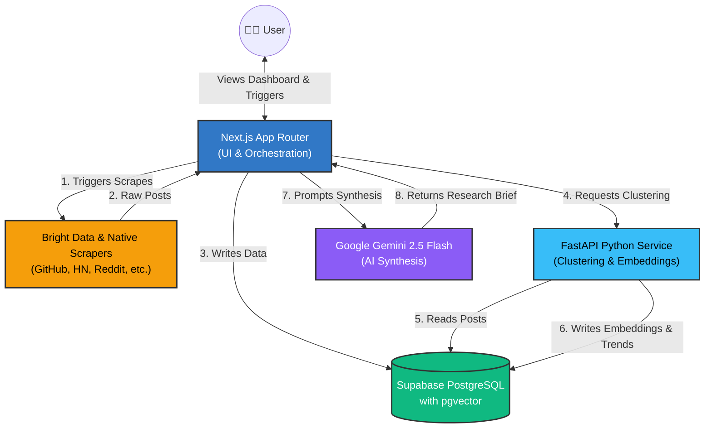
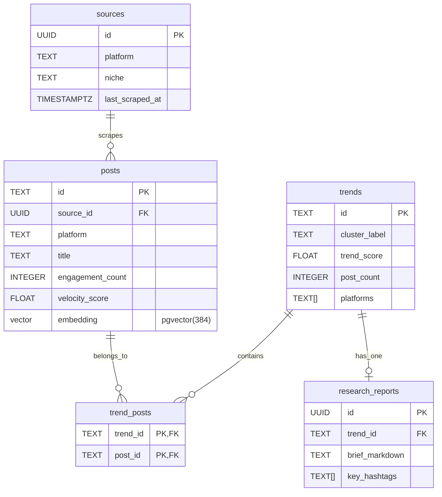

# TrendVerse — Real-Time Trend Intelligence for Developers

TrendVerse is a full-stack dashboard that tracks and clusters emerging developer trends in real-time across multiple platforms (GitHub, Hacker News, Product Hunt, Hugging Face, Dev.to, Reddit, Stack Exchange). By scraping, vectorizing post content, and clustering topics using KMeans, TrendVerse dynamically extracts hot topics, scores their velocity, and generates AI Research Briefs.

---

## 🏗️ Architecture

TrendVerse utilizes a robust, microservices-inspired architecture splitting frontend orchestration from heavy machine-learning workloads.



1. **Frontend & Orchestration**: Next.js 16 (App Router) handles the UI and all data ingestion. Scraping is performed via API routes using Bright Data and native HTTP requests.
2. **ML Backend**: Python FastAPI microservice dedicated to machine learning tasks like KMeans clustering and embedding generation via `SentenceTransformers` (`all-MiniLM-L6-v2`).
3. **Database**: Supabase PostgreSQL with `pgvector` for similarity search and Row Level Security (RLS).
4. **AI Generation**: Gemini 2.5 Flash is used to generate structured Research Briefs.

---

## 🗄️ Database Design

The database is built on Supabase PostgreSQL and is designed for fast relational queries as well as vector similarity searches.



*   **`sources`**: Tracks the platforms and niches we monitor.
*   **`posts`**: Stores individual scraped items. Crucially, it includes an `embedding` column powered by `pgvector` for 384-dimensional vectors.
*   **`trends`**: Represents a cluster of similar posts (grouped by the KMeans algorithm).
*   **`trend_posts`**: A junction table linking a trend to its constituent posts.
*   **`research_reports`**: Stores AI-generated markdown briefs synthesized from a specific trend's data.

Row Level Security (RLS) policies govern access, allowing anonymous users to read data while restricting writes to the service role.

---

## 🚀 Deployment Architecture

TrendVerse is deployed across specialized cloud providers to optimize for frontend edge delivery and backend compute performance.


1. **Vercel (Frontend & Serverless Functions)**:
    *   Hosts the Next.js React application.
    *   Serverless functions handle UI requests, API routing, and AI integration.
    *   `vercel.json` configures a Cron Job that hits `/api/ingest/run-all` every 30 minutes to automate scraping.
2. **Render (ML Backend)**:
    *   The `python-service` is containerized (via `Dockerfile`) and deployed as a web service on Render.
    *   This provides dedicated, persistent compute necessary for loading the ML models in memory and running computationally heavy clustering algorithms.
3. **Supabase (Database as a Service)**:
    *   Hosts the Postgres database with `pgvector` enabled.
    *   Manages connection pooling and Row Level Security for both Vercel and Render environments.

---

## ⚙️ Getting Started

### Prerequisites
- Node.js (v20+ recommended)
- Python (v3.9+ recommended)
- A Supabase project
- Gemini API Key

### 1. Database Setup (Supabase)
1. Open your Supabase Project dashboard, navigate to the **SQL Editor**.
2. Run the script found in `supabase/migrations/001_initial_schema.sql` to setup tables and `pgvector`.

### 2. Environment Configuration
Create a `.env.local` file:

```bash
NEXT_PUBLIC_SUPABASE_URL=https://<your-project-id>.supabase.co
NEXT_PUBLIC_SUPABASE_ANON_KEY=<your-anon-key>
SUPABASE_SERVICE_ROLE_KEY=<your-service-role-key>
GEMINI_API_KEY=<your-gemini-api-key>
INTERNAL_API_SECRET=<your-custom-shared-secret>
CRON_SECRET=<your-vercel-cron-secret>

# Scraper Settings
BRIGHTDATA_API_TOKEN=<token>
REDDIT_USER_AGENT=TrendVerse/1.0

# ML Python Service URL
ML_SERVICE_URL=http://localhost:8000
```

### 3. Backend Setup (FastAPI)
```bash
cd python-service
python -m venv venv
# Windows: .\venv\Scripts\activate  |  macOS: source venv/bin/activate
pip install -r requirements.txt
python -m uvicorn main:app --host 127.0.0.1 --port 8000 --reload
```

### 4. Frontend Setup (Next.js)
```bash
npm install
npm run dev
```
Open [http://localhost:3000](http://localhost:3000) to view the dashboard!
